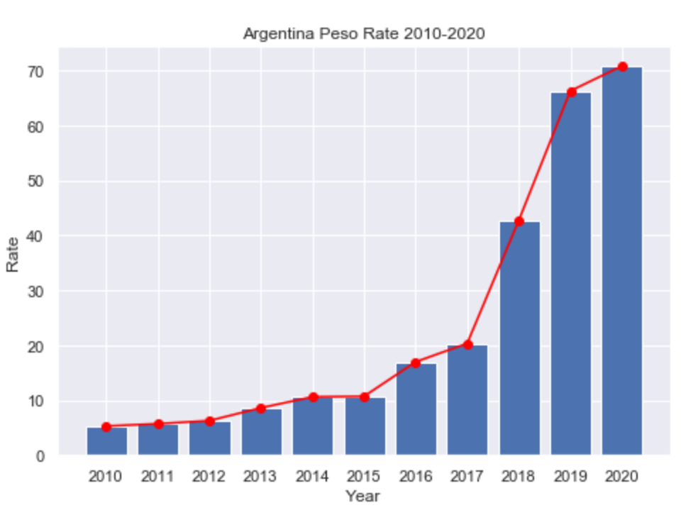
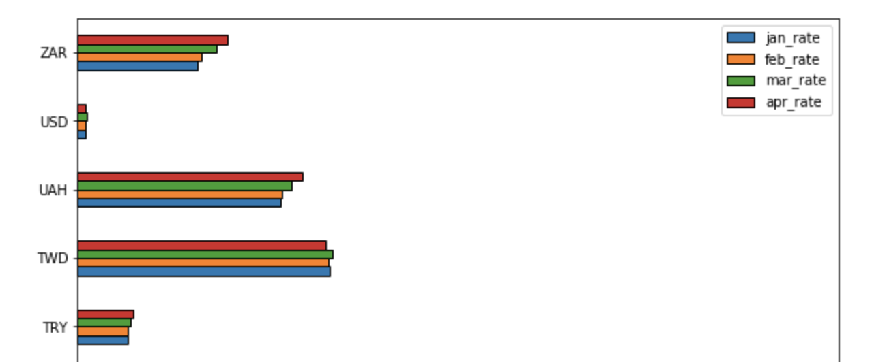

# Currency Convertor Online Data for Euro (€)

Authors:  
Wilson Jo Siu,
Pritish Shivananda Adiga,
Abhishek Shirsat and
Gokul Selvaraj

---

## Introduction

The currency converter (exchange rate) is a useful financial tool which allows the user to see the daily exchange monetary value of the Euro(€) in a variety of foreign currencias such as japanese yen, US dollar, Canadian Dollar, Indian Rupee,etc. The base unit for the currency converter is 1 euro and the equal value is displayed for the currencias as well when we request online data. The list of currencies provided are the ones who have a bigger relevance to the Europea Market.

Example:
On the date 04-08-2020, 1 euro equals to 1.0871 USD or 10436.7232 Vietnamese Dong.

The type of data we are importinng comes from a european currency converter webpage, but at the same time many of these webpages collect daily data from a single centralized entity, in this case the European Central Bank.

The source of the data can be adquired from multiple webpages, but some of them will not have a free API key to share, in many cases you are required to paid to have quick acess to this kind of information. In the financial market, it is important to be up to date as it will help make the most adequate financial decisions (forecasting, investments or stock market). 

The source of data is provided by an API currency converter "currency-converter5.p.rapidapi.com"

The acquired data is updated daily and we can also obtain data from previous years on specific days (the date limit to acquire the last point of data is from 2010-01-01) (dates and times are based on the current timezone you are located. 

---

## Sources

- The source code was obtained from:  https://rapidapi.com/natkapral/api/currency-converter5?endpoint=apiendpoint_a4bcb4ce-c9c6-4c58-8ed5-20ccb34098d2
The current link has information about the API key and webpage host. It also explains how the output will be like and what does it mean(format).It also has some additional information to understand the currency exchange data and what values you can obtain.

- Currency exchange rates are obtained from the European Central Bank: https://www.ecb.europa.eu/stats/policy_and_exchange_rates/euro_reference_exchange_rates/html/index.en.html 
The values that are given are also listed in the previous link.

- Programming for Analytics Video Lectures: Module 2 : Data Visualization and Module 5 : Online Data

---

## Explanation of the Code
The code, `euro_currency_converter`, begins by defining the variable to select date:

### Euro currency converter function 

The first part is focused on a user friendly code as it give you the following outputs:
- A list of all available currencies and their applied code
- The currency exchange value from today's date
- The currency exchange value from the input date

```
#Currency converter for Euro
# function input can be any date you want from January 01, 2010
# dates variable must be in the form of a string 'YYYY-MM-DD', this means in numeric YEAR-MONTH-DAY within a string type '' 
# example : '2020-01-11'
# note: if you input a date higher than the present date, it will give and error output

def desiredDate(dates): 

    # Input Rapidapikey provided by the rapidapi webpage
    RAPIDAPIKEY = 'InsertyourAPIkeyhere'

    # Defines the function
    dates = str(dates)
    
    # import
    import http.client  
    import json 
    import pandas as pd
    import numpy as np
    from datetime import date
    import matplotlib.pyplot as plt
    
    # Establish the connection to the particular API 
    conn = http.client.HTTPSConnection("apihostadress")
    
    headers = {'x-rapidapi-host': "apihostadress",'x-rapidapi-key': RAPIDAPIKEY}
    
    # First we will find the List of available currencies:
    # The select API have been provided free of cost and is available for everyone
    conn.request("GET", "/currency/list", headers=headers)
    
    resp  = conn.getresponse()
    data = resp.read().decode("utf-8") 
    currency = json.loads(data)
    
    
    # Next, we will check the currency exchange rate based on 1 euro
    #This means that we will obtain all the currencies values equal to 1 euro 
    conn.request("GET", "/currency/convert", headers=headers)
    resp = conn.getresponse()
    data2 = resp.read().decode("utf-8")
    convert = json.loads(data2)
    
    #change the data to a dataframe  
    currency_df= pd.DataFrame(currency)
    print(currency_df)
    
    print("Base amount Value: ",convert['amount'])
    
    print("Currency Base Name: ",convert['base_currency_name'])
    
    print("Currency Base Code: ",convert['base_currency_code'])
    
    # we put the current date to have a better visualization of the output
    today = date.today()
    print("Today's date:", today)
    
    print('\n')
    print('Today, the exchange currency values are:\n')
    
    #change the data to a dataframe
    convert_df= pd.DataFrame(convert['rates'])
    convert_df = convert_df.drop('rate_for_amount')
    print(convert_df)
    
    print('\n')
    print(dates, "The requested date exchange currency values are:\n")
    
    # prepare the dynamic code so we may choose which date we want to see the currency
    Requesteddate ="/currency/historical/" + dates + ""
    
    conn.request("GET", Requesteddate, headers=headers)
    resp = conn.getresponse()
    data = resp.read().decode("utf-8")
    historical = json.loads(data)
        
    #change the data to a dataframe
    historical_df= pd.DataFrame(historical['rates'])
    historical_df = historical_df.drop('rate_for_amount')
    print(historical_df)

```
 
 ### Analyze the data with multiple graphs
 
 The second part of the code is a clear example of how can we use the following online data to plot multiple graphs and analyze the results
 
 ```

        # get the Historical Currency Rates specifying the year - month - day
    conn.request("GET", "/currency/historical/2019-12-10", headers=headers)
    
    resp = conn.getresponse()
    data = resp.read().decode("utf-8")
    historical2019 = json.loads(data)
    historical2019
    
    #2018 data
    # get the Historical Currency Rates specifying the year - month - day
    conn.request("GET", "/currency/historical/2018-12-10", headers=headers)
    
    resp = conn.getresponse()
    data = resp.read().decode("utf-8")
    historical2018 = json.loads(data)
    historical2018
    
    #2017 data
    # get the Historical Currency Rates specifying the year - month - day
    conn.request("GET", "/currency/historical/2017-12-10", headers=headers)
    
    resp = conn.getresponse()
    data = resp.read().decode("utf-8")
    historical2017 = json.loads(data)
    
    #2016
    # get the Historical Currency Rates specifying the year - month - day
    conn.request("GET", "/currency/historical/2016-12-10", headers=headers)
    
    resp = conn.getresponse()
    data = resp.read().decode("utf-8")
    historical2016 = json.loads(data)
    
    #2015
    # get the Historical Currency Rates specifying the year - month - day
    conn.request("GET", "/currency/historical/2015-12-10", headers=headers)
    
    resp = conn.getresponse()
    data = resp.read().decode("utf-8")
    historical2015 = json.loads(data)
    
    #2014
    # get the Historical Currency Rates specifying the year - month - day
    conn.request("GET", "/currency/historical/2014-12-10", headers=headers)
    
    resp = conn.getresponse()
    data = resp.read().decode("utf-8")
    historical2014 = json.loads(data)
    
    #2013
    # get the Historical Currency Rates specifying the year - month - day
    conn.request("GET", "/currency/historical/2013-12-10", headers=headers)
    
    resp = conn.getresponse()
    data = resp.read().decode("utf-8")
    historical2013 = json.loads(data)
    
    #2012
    # get the Historical Currency Rates specifying the year - month - day
    conn.request("GET", "/currency/historical/2012-12-10", headers=headers)
    
    resp = conn.getresponse()
    data = resp.read().decode("utf-8")
    historical2012 = json.loads(data)
    
    #2011
    # get the Historical Currency Rates specifying the year - month - day
    conn.request("GET", "/currency/historical/2011-12-10", headers=headers)
    
    resp = conn.getresponse()
    data = resp.read().decode("utf-8")
    historical2011 = json.loads(data)
    
    #2010
    # get the Historical Currency Rates specifying the year - month - day
    conn.request("GET", "/currency/historical/2010-12-10", headers=headers)
    
    resp = conn.getresponse()
    data = resp.read().decode("utf-8")
    historical2010 = json.loads(data)
    
    # panda dataframe convert rate 
    today = pd.DataFrame(convert['rates'])
    today = today.T
    today = today.rename(columns={"rate": "present Rate"})
    today[['currency_name','present Rate']]
    
    # dataframe conversion of respective years -2019
    
    hist2019= pd.DataFrame(historical2019['rates'])
    hist2019= hist2019.T
    hist2019 = hist2019.rename(columns={"rate": "hist 2019"})
    hist2019_1=hist2019.drop(['currency_name','rate_for_amount'],axis=1)
    
    # dataframe conversion of respective years -2018
    
    hist2018= pd.DataFrame(historical2018['rates'])
    hist2018= hist2018.T
    hist2018 = hist2018.rename(columns={"rate": "hist 2018"})
    hist2018_1=hist2018.drop(['currency_name','rate_for_amount'],axis=1)
    
    # dataframe conversion of respective years -2017
    
    hist2017= pd.DataFrame(historical2017['rates'])
    hist2017= hist2017.T
    hist2017 = hist2017.rename(columns={"rate": "hist 2017"})
    hist2017_1=hist2017.drop(['currency_name','rate_for_amount'],axis=1)
    
    # dataframe conversion of respective years -2016
    
    hist2016= pd.DataFrame(historical2016['rates'])
    hist2016= hist2016.T
    hist2016 = hist2016.rename(columns={"rate": "hist 2016"})
    hist2016_1=hist2016.drop(['currency_name','rate_for_amount'],axis=1)
    
    # dataframe conversion of respective years -2015
    
    hist2015= pd.DataFrame(historical2015['rates'])
    hist2015= hist2015.T
    hist2015 = hist2015.rename(columns={"rate": "hist 2015"})
    hist2015_1=hist2015.drop(['currency_name','rate_for_amount'],axis=1)
    
    # dataframe conversion of respective years -2014
    
    hist2014= pd.DataFrame(historical2014['rates'])
    hist2014= hist2014.T
    hist2014 = hist2014.rename(columns={"rate": "hist 2014"})
    hist2014_1=hist2014.drop(['currency_name','rate_for_amount'],axis=1)
    
    # dataframe conversion of respective years -2013
    
    hist2013= pd.DataFrame(historical2013['rates'])
    hist2013= hist2013.T
    hist2013 = hist2013.rename(columns={"rate": "hist 2013"})
    hist2013_1=hist2013.drop(['currency_name','rate_for_amount'],axis=1)
    
    # dataframe conversion of respective years -2012
    
    hist2012= pd.DataFrame(historical2012['rates'])
    hist2012= hist2012.T
    hist2012 = hist2012.rename(columns={"rate": "hist 2012"})
    hist2012_1=hist2012.drop(['currency_name','rate_for_amount'],axis=1)
    
    # dataframe conversion of respective years -2011
    
    hist2011= pd.DataFrame(historical2011['rates'])
    hist2011= hist2011.T
    hist2011 = hist2011.rename(columns={"rate": "hist 2011"})
    hist2011_1=hist2011.drop(['currency_name','rate_for_amount'],axis=1)
    
    # dataframe conversion of respective years -2010
    
    hist2010= pd.DataFrame(historical2010['rates'])
    hist2010= hist2010.T
    hist2010 = hist2010.rename(columns={"rate": "hist 2010"})
    hist2010_1=hist2010.drop(['currency_name','rate_for_amount'],axis=1)
    
    result = pd.concat([today,hist2019_1,hist2018_1,hist2017_1,hist2016_1,hist2015_1,hist2014_1,hist2013_1,hist2012_1,hist2011_1,hist2010_1], axis=1, sort=False)
    final= result.drop(['rate_for_amount'],axis=1)
    final
    
    #converting all values of the currency rate from string to float
    # Add a new column named '' 
    # result1['Difference'] = result1['rate']- result1['historical_rate']
    # print(result1) 
    # result1
    
    final['present Rate'] = final['present Rate'].astype(float)
    final[['hist 2019','hist 2018','hist 2017','hist 2016','hist 2015','hist 2014','hist 2013','hist 2012','hist 2011','hist 2010']] = final[['hist 2019','hist 2018','hist 2017','hist 2016','hist 2015','hist 2014','hist 2013','hist 2012','hist 2011','hist 2010']].astype(float)

    
    INR =[82.873,78.561,82.7284,75.6775,71.341,73.0416,76.9233, 83.9149, 70.475,69.697,59.627]
   
    x = np.array(['2010','2011','2012','2013','2014','2015','2016','2017','2018','2019','2020']).astype(float)
    y = np.array([59.627,69.697,70.475,83.9149,76.9233,73.0416,71.341,75.6775,82.7284,78.561,82.873])
    m, b = np.polyfit(x, y, 1)
    plt.plot(x, y, 'b')
    plt.plot(x, m*x + b)
    plt.plot(x, y, '-o',color='orange')
    plt.title('INR Rate 2010-2020')
    plt.xlabel('Year')
    plt.ylabel('Exchange Rate'); 
    
    fig = plt.figure()
    ax = fig.add_axes([0,0,1,1])
    ZAR = [19.7624,16.4121,16.3463,16.0391,14.545,16.7143,14.243,14.1808,11.2365,10.9853,9.0684]
    def Reverse(ZAR): 
        INR.reverse() 
        return ZAR
    ZAR1 = Reverse(ZAR)
    Year = ['2010','2011','2012','2013','2014','2015','2016','2017','2018','2019','2020']
    plt.plot(Year, ZAR1, '-o',color='red')
    plt.title('South African Rand_ZAR Rate 2010-2020')
    plt.xlabel('Year')
    plt.ylabel('Exchange Rate');
    ax.bar(Year, ZAR)
    
    fig = plt.figure()
    ax = fig.add_axes([0,0,1,1])
    ARS = [70.7778, 66.243, 42.6901, 20.3201, 16.9606, 10.6917, 10.6041,
           8.5968, 6.2644, 5.7062, 5.2874]
    def Reverse(ARS): 
        ARS.reverse() 
        return ARS
    ARS1 = Reverse(ARS)
    Year = ['2010','2011','2012','2013','2014','2015','2016','2017','2018','2019','2020']
    plt.plot(Year, ARS1, '-o',color='red')
    plt.title('Argentina Peso Rate 2010-2020')
    plt.xlabel('Year')
    plt.ylabel('Exchange Rate');
    ax.bar(Year, ARS1)
    
    conn.request("GET", "/currency/historical/2020-01-09", headers=headers)
    resp = conn.getresponse()
    data = resp.read().decode("utf-8")
    jan = json.loads(data)
    
    conn.request("GET", "/currency/historical/2020-02-09", headers=headers)
    resp = conn.getresponse()
    data = resp.read().decode("utf-8")
    feb = json.loads(data)
    
    conn.request("GET", "/currency/historical/2020-03-09", headers=headers)
    resp = conn.getresponse()
    data = resp.read().decode("utf-8")
    mar = json.loads(data)
    
    conn.request("GET", "/currency/historical/2020-04-09", headers=headers)
    resp = conn.getresponse()
    data = resp.read().decode("utf-8")
    apr = json.loads(data)
    
    df1 = pd.DataFrame(jan['rates'])
    jan2020 = df1.T
    
    # jan2020
    
    df2 = pd.DataFrame(feb['rates'])
    feb2020 = df2.T
    
    # feb2020
    
    df3 = pd.DataFrame(mar['rates'])
    mar2020 = df3.T
    
    # mar2020
    
    df4 = pd.DataFrame(apr['rates'])
    apr2020 = df4.T
    
    # apr2020
    
    jan2020['rate'] = pd.to_numeric(jan2020['rate'])
    
    # jan2020 = jan2020.loc[jan2020['rate'] <= 10]
    
    jan2020.rename(columns = {'rate':'jan_rate'}, inplace = True)
    
    jan2020 = jan2020.iloc[:, :-1]
    
    feb2020['rate'] = pd.to_numeric(feb2020['rate'])
    
    feb2020.rename(columns = {'rate':'feb_rate'}, inplace = True)
    
    # feb2020 = feb2020.loc[feb2020['rate'] <= 10 ]
    
    mar2020['rate'] = pd.to_numeric(mar2020['rate'])
    
    mar2020.rename(columns = {'rate':'mar_rate'}, inplace = True)
    
    # mar2020 = mar2020.loc[mar2020['rate'] <= 10]
    
    apr2020['rate'] = pd.to_numeric(apr2020['rate'])
    
    apr2020.rename(columns = {'rate':'apr_rate'}, inplace = True)
    
    # apr2020 = apr2020.loc[apr2020['rate'] <= 10]
    
    xx = jan2020.join(feb2020['feb_rate'])
    
    yy = xx.join(mar2020['mar_rate'])
    
    myData = yy.join(apr2020['apr_rate'])
    
    myData = myData.loc[myData['apr_rate'] <= 100]
    
    myData.plot.barh(figsize = (10,50), edgecolor = 'black')

 
```
With the obtained data from the desired dates we can plot different types 







---

## How to Run the Code

Before starting we recommend downloading a python IDE or the anaconda package (https://www.anaconda.com/distribution/), which contains multiple Python/R platforms for Data Science. The following steps have been developed by Anaconda Prompt

1. Acess to the Anaconda Prompt (Python IDE), you will get the command window 

2. Type: ipython , inmmediately the interactive development enviroment of python will be loaded

3. Change directories to where `euro_currency_converter_V1_01` is saved.

3. Type: the following commands to select the folder where the files are located:
    import os
    os.chdir("C:/Users/Wilson/Desktop/hw5") -> this is the address for the folder, if you want to know the address right click on the    folder and select properties. The folder address will be essential as it detects the route to import the file
    os.getcwd()

4. Type: import euro_currency_converter_V1_01 as var

5. Type: var.desiredDate(dates) -> the dates value is represented by the string of the date (i the form '')

## Update log
V1 uploaded on 04/09/2020

V1_01 uploadad on 04/10/20:
Quick changes on script file regarding the function description, The api key and webpage host has been removed from the code as well.

---

## Suggestions

A currency converter is considered a useful financial tool because it give us up to date monetary values that. Another important function of the currency converter is that it can interpret how the market behaves by bomparing different dates for one same currency. Economic theories can explain the relationship of the currency values.

A fine example can be related to the Coronavirus and how it is affecting the financial market nowadays. On December 2019 on a specific date, the euro was equal to 1.1070 USD, but on March 12th 2020, the euro was equal to 1.1240 USD. This means the USD is getting a higher demand because investors dont want to but euros (currently a terrible time to invest in Europe)   

With the first part of the code we can have the fundamentals to build an app with python based coding that could be useful to obtain updated currency values.


