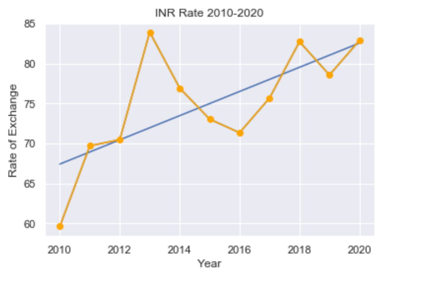
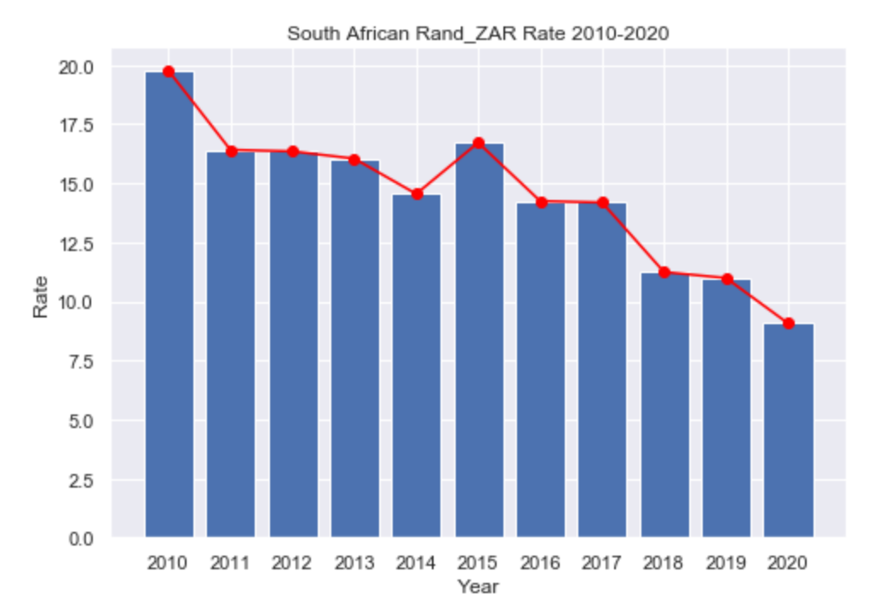

# Currency Convertor Online Data for Euro (€)

Authors:  
Wilson Jo Siu,
Pritish Shivananda Adiga,
Abhishek Shirsat and
Gokul Selvaraj

---

## Introduction

The currency converter (exchange rate) is a useful financial tool which allows the user to see the daily exchange monetary value of the Euro(€) in a variety of foreign currencias such as japanese yen, US dollar, Canadian Dollar, Indian Rupee,etc. The base unit for the currency converter is 1 euro and the equal value is displayed for the currencias as well when we request online data. The list of currencies provided are the ones who have a bigger relevance to the Europea Market.

Example:
On the date 04-08-2020, 1 euro equals to 1.0871 USD or 10436.7232 Vietnamese Dong.

The type of data we are importinng comes from a european currency converter webpage, but at the same time many of these webpages collect daily data from a single centralized entity, in this case the European Central Bank.

The source of the data can be adquired from multiple webpages, but some of them will not have a free API key to share, in many cases you are required to paid to have quick acess to this kind of information. In the financial market, it is important to be up to date as it will help make the most adequate financial decisions (forecasting, investments or stock market). 

The source of data is provided by an API currency converter "currency-converter5.p.rapidapi.com"

The acquired data is updated daily and we can also obtain data from previous years on specific days (the date limit to acquire the last point of data is from 2010-01-01) (dates and times are based on the current timezone you are located. 

---

## Sources

- The source code was obtained from:  https://rapidapi.com/natkapral/api/currency-converter5?endpoint=apiendpoint_a4bcb4ce-c9c6-4c58-8ed5-20ccb34098d2
The current link has information about the API key and webpage host. It also explains how the output will be like and what does it mean(format).It also has some additional information to understand the currency exchange data and what values you can obtain.

- Currency exchange rates are obtained from the European Central Bank: https://www.ecb.europa.eu/stats/policy_and_exchange_rates/euro_reference_exchange_rates/html/index.en.html 
The values that are given are also listed in the previous link.

- Programming for Analytics Video Lectures: Module 2 : Data Visualization and Module 5 : Online Data

---

## Explanation of the Code
The code, `euro_currency_converter`, begins by defining the variable to select date:
```
def desiredDate(dates): 

RAPIDAPIKEY = 'd88ac81114msh89e702e586cd793p16570djsn90c636b78795'  
dates = str(dates)
    
    import http.client  
    import json 
    import pandas as pd
    import numpy as np
    from datetime import date
    import matplotlib.pyplot as plt
    
 # Establish the connection to the particular API 
    conn = http.client.HTTPSConnection("currency-converter5.p.rapidapi.com")

    headers = {'x-rapidapi-host': "currency-converter5.p.rapidapi.com",'x-rapidapi-key': RAPIDAPIKEY}

# First we will find the List of available currencies:
# The select API have been provided free of cost and is available for everyone
    conn.request("GET", "/currency/list", headers=headers)

    resp  = conn.getresponse()
    data = resp.read().decode("utf-8") 
    currency = json.loads(data)

# Next, we will check the currency exchange rate based on 1 euro
#This means that we will obtain all the currencies values equal to 1 euro 
    conn.request("GET", "/currency/convert", headers=headers)
    resp = conn.getresponse()
    data2 = resp.read().decode("utf-8")
    convert = json.loads(data2)

#change the data to a dataframe  
    currency_df= pd.DataFrame(currency)
    print(currency_df)

    print("Base amount Value: ",convert['amount'])

    print("Currency Base Name: ",convert['base_currency_name'])

    print("Currency Base Code: ",convert['base_currency_code'])

# we put the current date to have a better visualization of the output
    today = date.today()
    print("Today's date:", today)

    print('\n')
    print('Today, the exchange currency values are:\n')

#change the data to a dataframe
    convert_df= pd.DataFrame(convert['rates'])
    convert_df = convert_df.drop('rate_for_amount')
    print(convert_df)

    print('\n')
    print(dates, "The requested date exchange currency values are:\n")

# prepare the dynamic code so we may choose which date we want to see the currency
    Requesteddate ="/currency/historical/" + dates + ""

    conn.request("GET", Requesteddate, headers=headers)
    resp = conn.getresponse()
    data = resp.read().decode("utf-8")
    historical = json.loads(data)
    
#change the data to a dataframe
    historical_df= pd.DataFrame(historical['rates'])
    historical_df = historical_df.drop('rate_for_amount')
    print(historical_df)
```
With the obtained data from the desired dates we can plot different types 






---

## How to Run the Code

Before starting we recommend downloading a python IDE or the anaconda package (https://www.anaconda.com/distribution/), which contains multiple Python/R platforms for Data Science. The following steps have been developed by Anaconda Prompt

1. Acess to the Anaconda Prompt (Python IDE), you will get the command window 

2. Type 'ipython' , inmmediately the interactive development enviroment of python will be loaded

3. Change directories to where `needs_a_good_name.py` is saved.

3. Type the following commands to select the folder where the files are located:
    import os
    os.chdir("C:/Users/Wilson/Desktop/hw5") -> this is the address for the folder, if you want to know the address right click on the    folder and select properties. The folder address will be essential as it detects the route to import the file
    os.getcwd()

4. Type import euro_currency_converter as var

5. Type var.desiredDate(dates) -> the dates value is represented by the string of the date (i the form '')

---

## Suggestions

A currency converter is considered a useful financial tool because it give us up to date monetary values that. Another important function of the currency converter is that it can interpret how the market behaves by bomparing different dates for one same currency. Economic theories can explain the relationship of the currency values.

A fine example can be related to the Coronavirus and how it is affecting the financial market nowadays. On December 2019 on a specific date, the euro was equal to 1.1070 USD, but on March 12th 2020, the euro was equal to 1.1240 USD. This means the USD is getting a higher demand because investors dont want to but euros (currently a terrible time to invest in Europe)   

There are many more interpretations we can get by comparing the different values.


